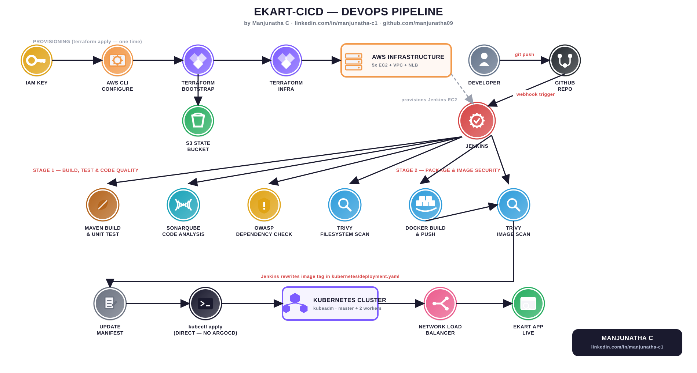
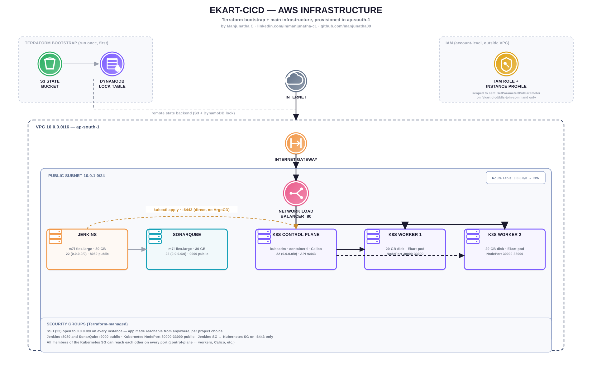

# ekart-cicd

A complete CI/CD pipeline for a Spring Boot app: Jenkins builds, tests, and
security-scans every commit, then deploys it directly to a self-managed
Kubernetes cluster running on AWS — all infrastructure provisioned with
Terraform.

**Live in ~2–3 minutes from `git push` to a rolling update in production**, with zero manual deployment steps.



## Why this project exists

I wanted a project that actually proves the skills on my resume instead of
just listing them — networking, AWS, Terraform, and DevOps tooling — by
building all of it end to end and running it on real infrastructure I
provisioned myself. Every box in the diagrams above and below is something
I configured, not a managed service doing the work for me.

## Architecture



| Layer | What it does |
|---|---|
| **Terraform bootstrap** | A separate, one-time Terraform project that creates the S3 bucket + DynamoDB lock table used as the remote state backend for everything else. |
| **Terraform infrastructure** | Provisions the entire AWS footprint: VPC, public subnet, security groups, IAM, an AWS Network Load Balancer, and 5 EC2 instances. |
| **Jenkins** | Builds, tests, scans, and deploys on every push — the CI *and* CD engine here (see note below on why there's no Argo CD in the live path). |
| **SonarQube** | Static code analysis + quality gate — a build fails the pipeline if code quality drops below the bar. |
| **OWASP Dependency-Check + Trivy** | Scans dependencies and the built image for known CVEs, so vulnerable builds get flagged before they ship. |
| **Docker Hub** | Stores every build as an immutable, versioned image (`manja098/ekart:<build-number>`) — never overwrites `:latest`, so any past build can be redeployed exactly. |
| **Kubernetes (kubeadm)** | A real, self-managed cluster — 1 control plane + 2 workers — not a managed EKS control plane. I run `kubeadm init`, install the CNI, and join nodes myself. |
| **AWS Network Load Balancer** | Fronts both worker nodes so the app has one stable URL regardless of which node currently holds the pod. |

## The pipeline, end to end

This is what happens between me pushing code and the change being live:

1. **`git push` to `main`** — I edit code locally and push.
2. **GitHub webhook fires** — GitHub calls Jenkins's `/github-webhook/` endpoint immediately.
3. **Jenkins checks out the repo** and runs a guard check (skips if the last commit was a bot commit, to prevent CI loops).
4. **Maven build + unit tests** (`mvn clean verify`) — the build stops here if tests fail.
5. **SonarQube static analysis + quality gate** — scans for bugs, code smells, and security hotspots; the pipeline aborts if the quality gate fails.
6. **OWASP Dependency-Check** — cross-references every dependency against the National Vulnerability Database.
7. **Trivy filesystem scan** — scans the source tree itself for known-vulnerable files/configs.
8. **Docker build** — packages the app into a container image tagged with the Jenkins build number.
9. **Trivy image scan** — scans the *built image* (OS packages + app layers) for HIGH/CRITICAL CVEs.
10. **Docker push** — the versioned image goes to Docker Hub.
11. **Jenkins updates `kubernetes/deployment.yaml`** in its own workspace, rewriting the image tag to the new build number.
12. **`kubectl apply`** — Jenkins applies the updated manifest directly against the Kubernetes API server (over the Jenkins-security-group → Kubernetes-security-group rule on port 6443).
13. **Kubernetes performs a rolling update** — `maxUnavailable: 0` means there's no downtime; the new pod comes up before the old one is terminated.
14. **Rollout verification** — Jenkins waits on `kubectl rollout status` and prints the final pod/service state before marking the build green.

No manual `kubectl` commands, no manual image tagging, no manual redeploy — the only human action in this entire loop is step 1.

### A note on Argo CD

The Terraform bootstrap installs Argo CD onto the cluster (in case I want to
move to a GitOps model later), but **the live deployment path in this
project does not use it** — Jenkins calls `kubectl apply` directly, which is
simpler to reason about for a project this size and doesn't require a
second Git repository/commit round-trip. See [Future Improvements](#future-improvements)
for why I'd add it back for a larger system.

## Tech stack

`Java 17` · `Spring Boot 3` · `Maven` · `Jenkins` · `SonarQube` · `OWASP Dependency-Check` · `Trivy` · `Docker` · `Docker Hub` · `Kubernetes (kubeadm)` · `containerd` · `Calico` · `Terraform` · `AWS (EC2, VPC, NLB, IAM, Security Groups, SSM)`

## Repository layout

```
ekart-cicd/
├── app/                     Spring Boot source, pom.xml, Dockerfile
├── kubernetes/              deployment.yaml, service.yaml
├── argocd/                  Application manifest (installed, currently unused — see note above)
├── jenkins/                 Jenkinsfile — the full pipeline
├── terraform/
│   ├── bootstrap/           One-time: creates the Terraform S3 state bucket + DynamoDB lock table
│   └── infrastructure/      VPC, security groups, load balancer, EC2 instances, bootstrap scripts
├── scripts/                 Local helper scripts
└── docs/                    Architecture + pipeline diagrams (this README's images)
    ├── ekart-pipeline-infographic.svg
    └── ekart-aws-architecture.svg
```

## Running it yourself

**Prerequisites:** AWS account, AWS CLI configured, Terraform ≥ 1.5, an EC2 key pair, a Docker Hub account, this repo forked/cloned.

```bash
# 1. Create the Terraform state bucket (one-time)
cd terraform/bootstrap
terraform init && terraform apply

# 2. Paste the bucket name into terraform/infrastructure/backend.tf, then:
cd ../infrastructure
cp terraform.tfvars.example terraform.tfvars   # edit key_pair_name if needed
terraform init && terraform apply
```

This launches all 5 EC2 instances and bootstraps each one automatically
(Jenkins, SonarQube, kubeadm cluster with auto-join via SSM). Give it
5–10 minutes, then:

```bash
terraform output   # note jenkins_public_ip, sonarqube_public_ip, app_url, etc.
```

**Manual one-time setup** (can't be automated by Terraform):
- Unlock Jenkins, install plugins (SonarQube Scanner, OWASP Dependency-Check, Pipeline: GitHub, Docker Pipeline), add `dockerhub` credentials, configure the SonarQube server connection, create the pipeline job pointing at `jenkins/Jenkinsfile`.
- **Copy a working kubeconfig onto the Jenkins box** so `kubectl apply` in the pipeline can reach the cluster — copy `/etc/kubernetes/admin.conf` from the Kubernetes control-plane instance to `~/.kube/config` (or `/var/lib/jenkins/.kube/config`) on the Jenkins instance. Port 6443 is already open between the two security groups.
- Add the GitHub webhook pointing at `http://<jenkins-ip>:8080/github-webhook/`.

Full step-by-step is in [`terraform/infrastructure`](terraform/infrastructure) and [`terraform/bootstrap`](terraform/bootstrap).

## Security note

SSH and the app itself are reachable from `0.0.0.0/0` (anywhere on the
internet) rather than restricted to a single IP — a deliberate choice for
this project so it's easy to demo from anywhere, including for anyone
reviewing this on my resume. For a production system I'd restrict SSH to a
bastion host or a specific IP range instead; see [Future Improvements](#future-improvements).

## Future improvements

- **GitOps with Argo CD** — commit the manifest change back to Git instead of `kubectl apply` from Jenkins, and let Argo CD reconcile it; gives an audit trail and easy rollback via `git revert`.
- **Restrict SSH** to a specific IP/bastion instead of `0.0.0.0/0`.
- **HTTPS** — put the NLB behind an ACM certificate, or add an Ingress controller with cert-manager.
- **Horizontal Pod Autoscaler** — scale pod count based on CPU/memory instead of a fixed `replicas: 2`.
- **Observability** — Prometheus + Grafana for cluster/app metrics, centralized logging (e.g. Loki or CloudWatch Logs).
- **Private worker subnets** — move workers into a private subnet behind a NAT Gateway, keeping only the load balancer public.
- **Multi-environment pipeline** — separate `staging` and `production` deploy stages with a manual approval gate.

## Screenshots

*(Add these once you have them — they make a huge difference on a resume-linked repo: a screenshot of the Jenkins pipeline stage view showing all green stages, the SonarQube dashboard for this project, and the running app itself.)*

## Contact

Manjunatha C — [manjuc.28.06@gmail.com](mailto:manjuc.28.06@gmail.com) · [GitHub](https://github.com/manjunatha09) · [LinkedIn](https://www.linkedin.com/in/manjunatha-c1/)
